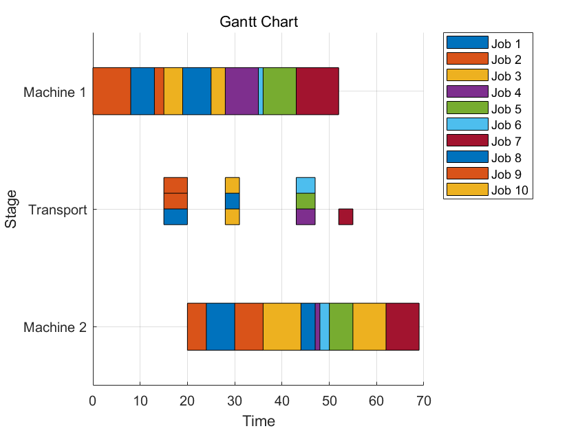

# Genetic Algorithm for Job Scheduling

This repository contains MATLAB code for solving a job scheduling problem using a genetic algorithm. The script initializes the task parameters and runs a genetic algorithm to optimize the job scheduling with considerations for processing times, transportation times, and penalties for earliness and tardiness.


## Result as Gantt Chart



## Usage


1. Configure the settings in the `main.m` script:

### Task Parameters

- `processingTimes1`: A list of processing times for the first stage of each job.
- `transportationTimes`: A list of transportation times between stages for each job.
- `processingTimes2`: A list of processing times for the second stage of each job.
- `transCapacity`: The transportation capacity, indicating how many jobs can be transported at once.
- `returnTime`: The time it takes for the transportation resources to return.
- `dueDates`: A list of due dates for each job to be completed.
- `earlinessPenalty`: A list of penalties for completing each job earlier than its due date.
- `tardinessPenalty`: A list of penalties for completing each job later than its due date.
- `w1`: Weight parameter for the fitness function, influencing the importance of penalties.
- `w2`: Weight parameter for the fitness function, influencing the importance of penalties.

### Genetic Algorithm Parameters

- `numGenerations`: The number of generations for the genetic algorithm to run.
- `popSize`: The size of the population in the genetic algorithm.
- `crossoverRate`: The probability of crossover between pairs of individuals.
- `mutationRate`: The probability of mutation in an individual.
- `use_NEH`: Boolean flag to determine whether to use the NEH heuristic for initialization.
- `use_local_search`: Boolean flag to determine whether to apply local search for optimization.


2. Run the `main.m` script:
    ```matlab
    main
    ```

## Functions

### Main Script
- `main.m`: Initializes parameters, runs the genetic algorithm, and prints results.

### Helper Functions
- `initializePopulationNEH`: Initializes population using the NEH heuristic.
- `initializePopulation`: Initializes a random population.
- `calculateFitness`: Evaluates the fitness of a solution.
- `rouletteWheelSelection`: Selects parents for crossover based on fitness.
- `pmxCrossover`: Performs partially mapped crossover on two parents.
- `insertionMutation`: Mutates a solution by inserting an element at a new position.
- `localSearch`: Improves a solution using local search methods.
- `reshape_2D`: Reshapes a solution into a 2D matrix for easy interpretation.
- `plotGanttChart`: Plots a Gantt chart to visualize the scheduling.

## License

This project is licensed under the MIT License - see the [LICENSE](LICENSE) file for details.
